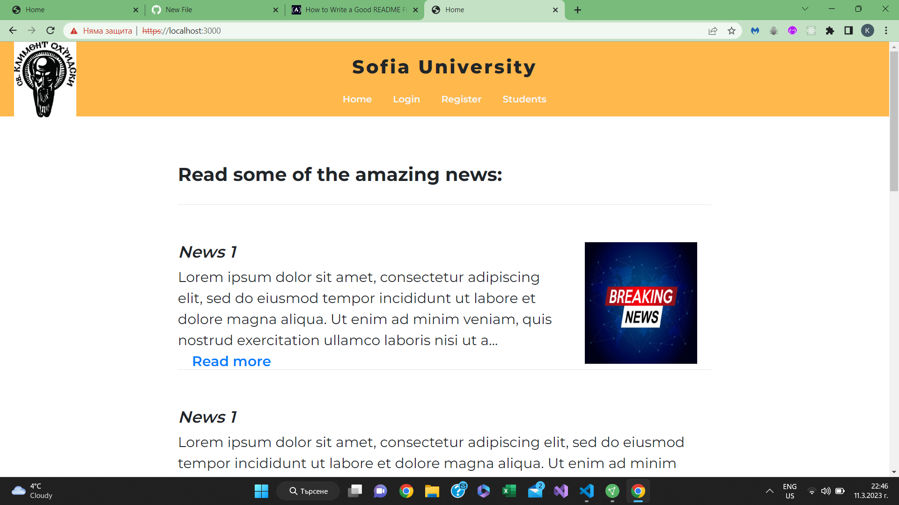
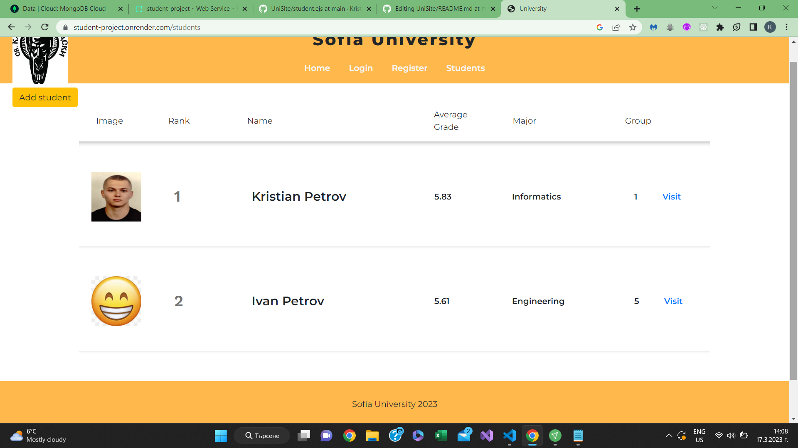
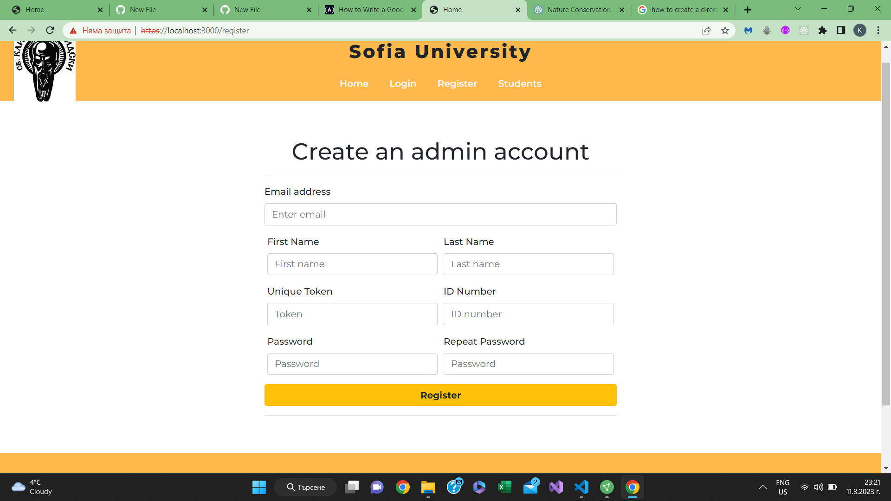
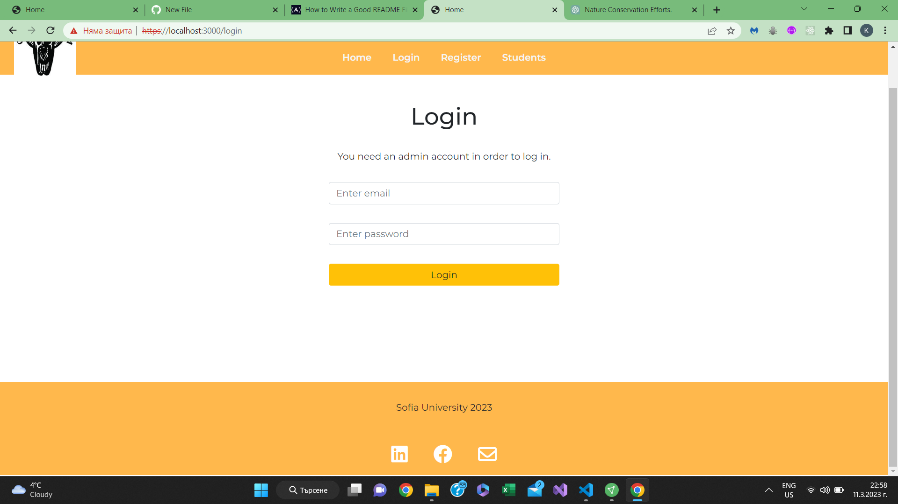
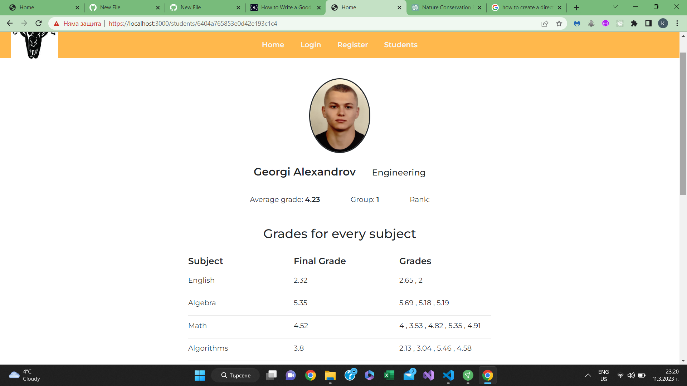
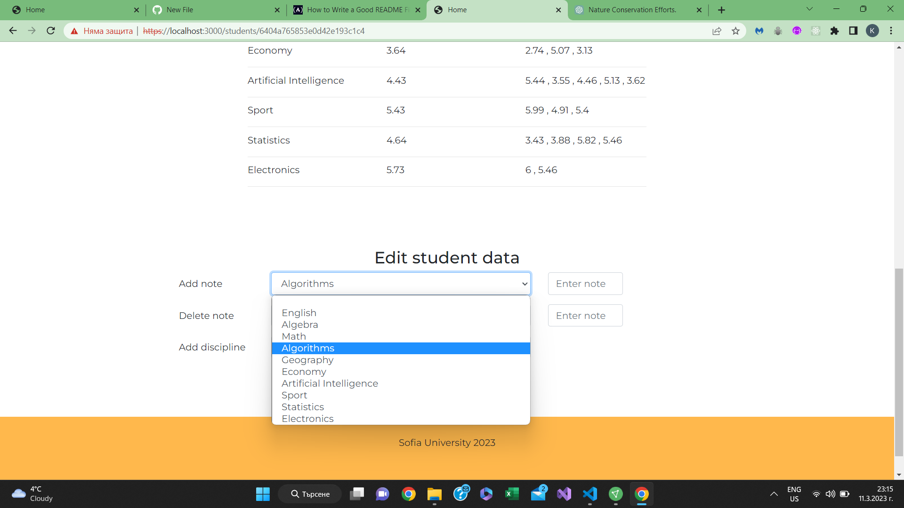
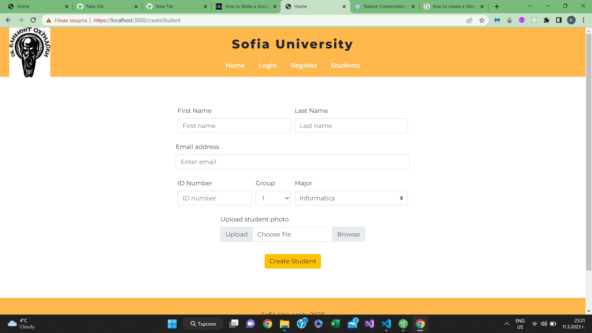
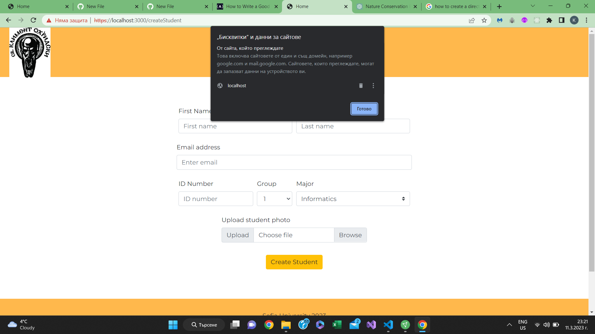

<h1>Student Information Web project</h1>
<h2>Build using NodeJS, Express and MongoDB/h2>
<h2>Frontend - EJS, JavaScript, HTML, CSS and Bootstrap<h2>

<h2>Description</h2>

The site imitates a student information app, where the user can see a student ranklist, register as an admin, login, read articles and create students.

Serve side rendering

There are many cool features like authentication, authorization, advanced hasing, https, sessions, cookies, ecnrypted connetion and others.

<h3>Packages<h3>

Mongoose, express, passport, passport-local, session, multer and others

<h1>Functionalities<h1>

<h2>Home page</h2>

Home page with articles where you can choose to read the full acrticles.

In the top left corner is https link, used to encrypt the connection

<h2>Students page</h2>

Ranklist with students sorted according to their average grade.

Fun fact: I've use only one my photo to fill the students

<h2>Register page</h2>

We can register an admin who can edit the data.

We save the password in the database encrypted and hashed

<h2>Login page</h2>

We can register an admin who can edit the data.

<h2>Student page</h2>

Student with his notes for every discipline as his average note

<h2>Modify student page</h2>

The dropdown is synchornized with his disciplines

<h2>Create student page</h2>

We can also upload and store the photo.

<h2>Cookies</h2>

We store the session

<h5>Notes:</h5>

Important keys are in the environment file.

There is a test data file, which enables us to create random students.
